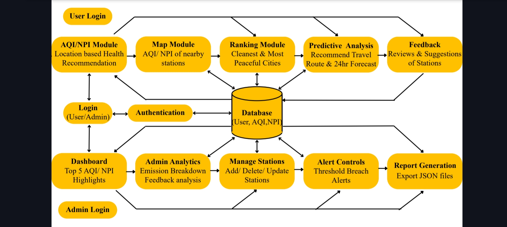

# EcoGauge - Air Quality and Noise Pollution Monitoring Dashboard

<br> 
 
| [](https://linkedin.com/in/deviprasad-shetty-4bba49313) | [](https://deviprasadshetty.com/) | [](https://github.com/DeviprasadShetty9833/My_Projects)  |                      
|---|---|---|

---

# Overview 

**EcoGauge** is a web-based real-time environmental monitoring dashboard that integrates and visualizes data from a network of monitoring stations across Mumbai, displaying both the Air Quality Index (AQI) and the Noise Pollution Index (NPI) on an interactive map. This project aims to design and implement a unified, real-time monitoring dashboard that seamlessly integrates and visualizes both Air Quality Index (AQI) and Noise Pollution Index (NPI) data across the Mumbai region. The system focuses on translating complex environmental data into a visually engaging and user-friendly interface, featuring an interactive geospatial map, detailed data cards, and historical trend charts for comprehensive analysis. By providing location-specific, real-time data along with actionable health recommendations, the dashboard empowers citizens to make informed daily decisions that help mitigate personal health risks. Furthermore, the platform serves as a valuable tool for researchers, policymakers, and urban planners, promoting environmental awareness and enabling data-driven strategies for building a cleaner, quieter, and healthier city.

| EcoGauge Progress |  |
|---|---|
| Pending | 🔗 Website Deployment |

## <div align="center"> 🔗 Live Website: [EcoGauge]() </div>

# Objective 

- To design and implement a unified, real-time monitoring dashboard that integrates and visualizes both Air Quality Index (AQI) and Noise Pollution Index (NPI) data across the Mumbai region.
- To translate complex environmental data into an accessible, user-friendly interface using an interactive geospatial map, regional comparisons and historical trend charts.
- To empower citizens with location-specific, real-time data and actionable health recommendations, enabling them to make informed daily decisions to mitigate personal health risks.
- To aid researchers, and inform urban planners, fostering greater environmental awareness and enabling data-driven decisions for a healthier city.

# Key features 

### User

<br> 
<br> Access real-time air quality data with up-to-the-minute accuracy and monitoring.

<br> 
<br> Detailed pollutant breakdowns through comprehensive Application Programming Interface (APIs).

<br> 
<br> Advanced analytics including Regional Comparisons, Historical Trend analysis, and Geospatial Analysis.

<br> 
<br> Location-specific health recommendations based on current air quality conditions.

### Admin

<br> 
<br> Comprehensive management of station data with easy monitoring and control capabilities.

<br> 
<br> Instant threshold breach alerts to notify users when air quality parameters exceed safe limits.

<br> 
<br> Interactive graphical dashboards providing visual insights and data representation.

<br> 
<br> Automated report generation for comprehensive data analysis and documentation.

### Additional features 

<br> 
<br> Secure password recovery system sending reset links directly to user email addresses.

<br> 
<br> Extended weather forecasting with 24, 48, and 72-hour predictions for better planning.



# Tech Stack

[](https://skillicons.dev)

```
Java, SpringBoot, Html, CSS, Js, MySQL, SpringSecurity, OAuth 2.0
```

# [Project Structure](https://github.com/DeviprasadShetty9833/EcoGauge/blob/54f6c85e7c478bc6f42c2846425ad186341f1bb6/assets/docs/Structure.txt)

<!--

```html
Tree structure Example

EcoGauge/
│
├── 📂 frontend/                       # 🌐 User Interface
│   ├── index.html                     # Landing Page (AQI + NPI Overview)
│   ├── login.html                     # Login/Signup
│   ├── aqi_home.html                  # AQI Dashboard (graphs, cards, facts)
│   ├── npi_home.html                  # NPI Dashboard (graphs, cards)
│   ├── aqi_map.html                   # Interactive AQI Map
│   ├── npi_map.html                   # Interactive NPI Map
│   ├── ranking.html                   # City/Station Rankings
│   ├── feedback.html                # User feedback form
│   ├── admin_dashboard.html           # Admin dashboard with analytics
│   │
│   ├── css/
│   │   ├── style.css                  # Global styling
│   │   ├── map.css                    # Map-specific styles
│   │   └── dashboard.css              # Admin dashboard styles
│   │
│   ├── js/
│   │   ├── main.js                    # Core frontend logic (fetch APIs, UI updates)
│   │   ├── map.js                     # Leaflet/Mapbox AQI map logic
│   │   ├── ranking.js                 # Ranking filters, sorting
│   │   ├── feedback.js                # Feedback submission
│   │   ├── admin.js                   # Admin analytics charts, filters
│   │   ├── chart.js                   # Chart.js graphs for AQI/NPI
│   │   └── predictive.js              # Fetch forecast data from ML backend
│   │
│   └── assets/
│       ├── images/                    # All images (banners, icons)
│       ├── icons/                     # AQI/NPI icon sets
│       └── data_samples/              # Example data for demos

│
├── 📂 backend/                        # ☁️ Spring Boot Backend
│   ├── src/
│   │   ├── main/java/com/ecogauge/
│   │   │   ├── controller/            # REST controllers
│   │   │   │   ├── AQIController.java
│   │   │   │   ├── NPIController.java
│   │   │   │   ├── FeedbackController.java
│   │   │   │   ├── AdminController.java
│   │   │   │   └── PredictionController.java
│   │   │   │
│   │   │   ├── model/                 # Entity classes (tables)
│   │   │   │   ├── Station.java
│   │   │   │   ├── AQIData.java
│   │   │   │   ├── NPIData.java
│   │   │   │   ├── Feedback.java
│   │   │   │   └── User.java
│   │   │   │
│   │   │   ├── repository/            # JPA interfaces
│   │   │   │   ├── AQIRepository.java
│   │   │   │   ├── NPIRepository.java
│   │   │   │   └── FeedbackRepository.java
│   │   │   │
│   │   │   ├── service/               # Business logic layer
│   │   │   │   ├── AQIService.java
│   │   │   │   ├── NPIService.java
│   │   │   │   ├── FeedbackService.java
│   │   │   │   └── PredictionService.java
│   │   │   │
│   │   │   ├── config/                # Security, API, and CORS settings
│   │   │   │   ├── WebSecurityConfig.java
│   │   │   │   └── ApiConfig.java
│   │   │   │
│   │   │   └── EcoGaugeApplication.java
│   │   │
│   │   └── resources/
│   │       ├── application.properties # DB credentials, API keys
│   │       └── static/ & templates/   # Optional if using Thymeleaf
│   │
│   ├── pom.xml                        # Spring Boot dependencies
│   └── Dockerfile                     # For container deployment

│
├── 📂 predictive_engine/              # 🧠 ML Model for Forecasting
│   ├── data/
│   │   ├── historical_aqi.csv
│   │   ├── historical_npi.csv
│   │   └── weather_data.csv
│   │
│   ├── model/
│   │   ├── aqi_model.pkl              # Trained AQI forecast model
│   │   ├── npi_model.pkl              # Trained NPI forecast model
│   │   └── preprocessing_pipeline.pkl
│   │
│   ├── scripts/
│   │   ├── train_model.py             # ML training script
│   │   ├── predict_aqi.py             # Prediction logic
│   │   └── predict_npi.py
│   │
│   ├── api/
│   │   └── predictive_server.py       # Flask app serving predictions via REST API
│   │
│   ├── requirements.txt               # Python dependencies (Flask, sklearn, pandas)
│   └── README.md

│
├── database/                          # 🗄 DB scripts
│   ├── schema.sql                     # Create tables
│   ├── seed_data.sql                  # Dummy AQI/NPI data
│   └── queries.sql                    # Common queries

│
├── docs/                              # 📜 Documentation
│   ├── system_architecture.txt
│   ├── flowchart.txt
│   ├── ER_diagram.txt
│   ├── presentation_script.txt
│   └── poster_content.txt

│
└── README.md                          # Project overview, setup instructions

```
-->

# Entity-Relationship(ER) Diagram 


# Future Scope 

- Geographic Expansion: Scale the platform to include other major cities in Maharashtra (Pune, Nagpur) or across India
- Mobile App: Develop native iOS and Android applications for better performance, offline capabilities (limited), and push notifications.
- Public Transport Suggestions: Suggest routes with lower pollution noise exposure based on real-time data.
- Layer Toggling: Allow users to switch between viewing AQI, Noise, Traffic, Weather layers on the map.
- User Accounts: Allow users to save favorite locations, customize their dashboard view,
- API Development: Create public API for your aggregated processed data that other developers or researchers could use

# Contributors
- [Deviprasad Shetty](https://github.com/DeviprasadShetty9833) - Frontend & Backend
- [Rupam Singh](https://github.com/Rupam0990) - Database & Backend
- [Tayyabali Sayyed](https://github.com/tayyabsayyad) - Project Guide
# Feedback:
<br> I’d love to hear from you!
<br> If you encounter any [Bugs](Issue_Template/Bug_report.md), [Issues](https://github.com/DeviprasadShetty9833/EcoGauge/issues), or have [Suggestions](Issue_Template/Features_report.md) for improvements.

# Support:
If you like ❤️ this project, give it a ⭐ (Top right of page) and share it with friends!

---

| [](#Overview) |  [](https://deviprasadshetty.com/) |  [](https://linkedin.com/in/deviprasad-shetty-4bba49313) |
|---|---|---|
